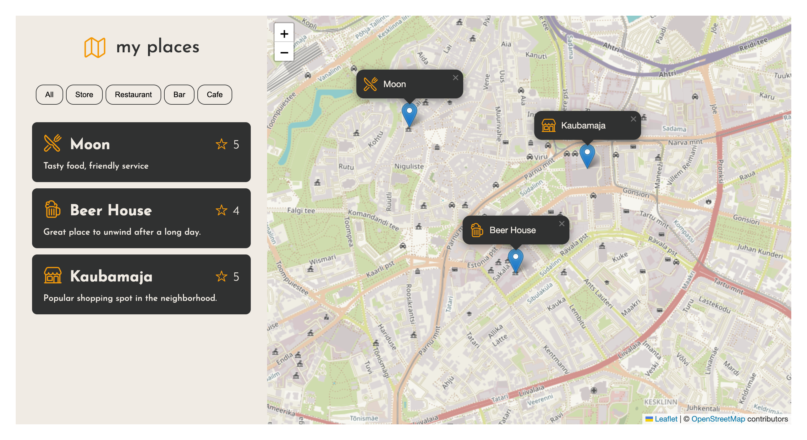

## 📍 My Favorite Places Map

A simple interactive map web app where users can save, view, and filter their favorite places like stores, bars, restaurants.

### 🔥 Features

- ✅ Save places by clicking directly on the map
- 📝 Add custom names, comments, and ratings
- 📌 Add place type: store, restaurant, bar, etc.
- 📂 View all saved places in a list
- 🗂️ Filter places by type
- 🗺️ Center map on any place from the list
- 💾 Saves all data in localStorage (persists after reload)
- 🧹 Delete any saved place
- 🎨 Smooth UI with dynamic icons and popups

### ⚙️ How It Works

1. Click anywhere on the map to open the place form.
2. Fill in the name, type, comment, and rating.
3. The place gets saved and shown on the map and in the list.
4. Click on a list item to center the map on it.
5. Filter by type to easily find specific places.

### 🛠️ Technologies Used

- **JavaScript (ES6+)**
- **Leaflet.js** for interactive maps
- **HTML + CSS**
- **LocalStorage API** for persistent data
- **OpenStreetMap** as the map tile provider

### 📦 How to Run

1. Clone this repo or download the files.
2. Open `index.html` in your browser.
3. Done! No backend or setup required.

or

https://artjom-webcode.github.io/top-places/
